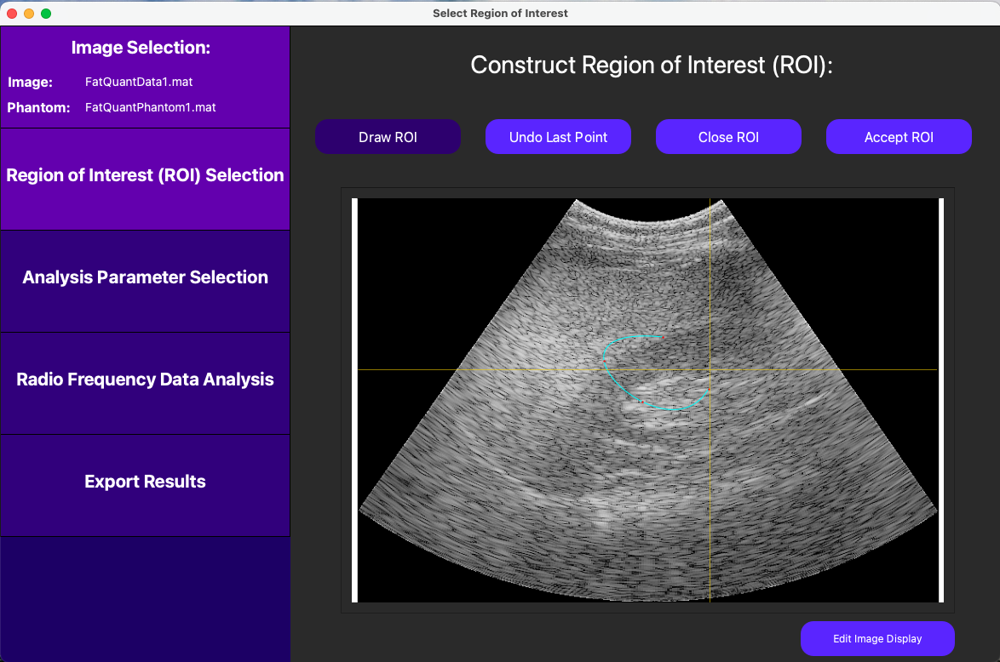
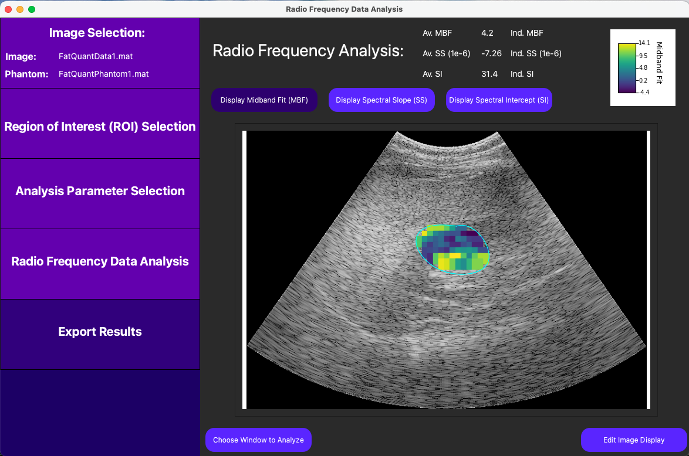

# 2D Ultrasound Tissue Characterization Tool

## Overview

This program is a 2D radiofrequncy (RF) analysis tool which allows user to input the RF data of an image to analyze as well as a phantom image. From here, a Bmode image is generated, the user can draw a region of interest (ROI) on the image, and then the program calculates the power spectrum within each window of user-defined size within the ROI. The midband fit (MBF), spectral slope (SS), and spectral intercept (SI) spectral parameters are then calculated from each window, and their average within the ROI is displayed.

The program displays this data in the form of a parametric map. The spectral parameters of each individual window in the ROI can be viewed by selecting the window of interest as shown below.

### Draw ROI



### Resulting Parametric Map with Average Spectral Parameters



### Individual Window Results


## Dependencies

* [Python Version 3.9.13](https://www.python.org/downloads/release/python-3913/)
* [Git](https://git-scm.com/downloads)
* C Compiler (uses [GCC](https://gcc.gnu.org/) by default on Unix systems)

## Building

### Mac/Linux

```shell
git clone https://github.com/davidspector67/2dUtcTool.git
cd 2dUtcTool
pip install virtualenv
python -m venv venv
source venv/bin/activate
pip install -r pyPackages.txt
deactivate
cd Parsers
gcc -c -Wall -Wpedantic philips_rf_parser.c
git -o philips_rf_parser philips_rf_parser.o
cd ..
```

### Windows

```shell
git clone https://github.com/davidspector67/2dUtcTool.git
cd 2dUtcTool
pip install virtualenv
python -m venv venv
call \venv\scripts\activate.bat
pip install -r pyPackages.txt
deactivate
```

From here, compiler Parser\philips_rf_parser.c into Parser\philips_rf_parser executable using preferred C compiler.

## Running

### Mac/Linux

```shell
call venv\scripts\activate.bat
python main.py
deactivate
```

### Windows

```shell
source venv/bin/activate
python main.py
deactivate
```
